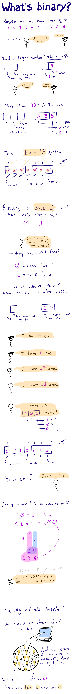

### Lesson notes

##### Two aspects of languages

- Programming language has two aspects:
    - syntax (rules of writing code, spelling, word order)
    - semantics (idea, meaning)
- Some programming languages have similar syntax.
- Some programming languages have exotic, unusual syntax.
- Semantics is hard to see, it's not explicit.

##### Syntax and semantics

- In modern languages *good code* means easy to understand semantics.
- If it's hard to understand what code does, than code is not too good.
- Syntax is easy to understand.
- Syntax is necessary to know, but not sufficient.

##### Choosing a language

- It is not **very** important which language to learn first.
- You will switch languages and use multiple languages and technologies at the same time. It's not a big deal.
- We chose JavaScript, because it's simple, very popular and works almost everywhere.
- JavaScript is used to write websites, mobile apps, server software and much much more.
- This website uses JavaScript right now.
- JavaScript programs are running on your computer right now.

### Optional

- [Turing Machines Explained - Computerphile](https://www.youtube.com/watch?v=dNRDvLACg5Q)
- [How smart is today’s artificial intelligence? / PBS Newshour](http://www.pbs.org/newshour/bb/smart-todays-artificial-intelligence/)
- [Why Use Binary? - Computerphile](https://www.youtube.com/watch?v=thrx3SBEpL8)

You're going to write programs in a modern programming language, and most of the time you won't see binary code — those zeroes and ones or *bits*. But you need to understand the **idea** behind binary numbers. Here is a short and simple illustrated explanation:

### Lesson transcript

We have called this system of pushing buttons a 'language'. The lever seems to be a separate thing, it's like a "RUN" command. We put in the code with the buttons, and then RUN the code with the lever.

You know how linguists discuss grammar, structure of words and stuff like that? They don't really care about novels or songs or stories, they are very much interested in the language used in those novels, songs and stories. They care about the code. Most people are the other way around: we care about the story, about the meaning. Not only in books and movies, but in everyday life: when I'm telling my girlfriend to buy me another sketchbook because I'm doing awkward drawings for teaching, I care about the result, the goal, not about the grammar and the history of the word "sketch". 

We can think of language having two... things to think about or two aspects: grammar and meaning. Programming languages are similar to this, but since programming languages are way simpler than human languages, there isn't much grammar, there is mostly syntax — word order and spelling. And for the meaning, computer scientists use a fancy word "semantics".

Let's compare Tota's magic box language with some modern programming language.

This box has very hard syntax, it's difficult to operate with X's and O's. On the other hand, this modern code looks... well, like English! This syntax is much easier to grasp, we can at least guess what each word means. 

The set of rules that describe how symbols and words can be used is the syntax.

You will see that some programming languages have similar syntax, and some have exotic, unusual syntax.

The semantics or the meaning is harder to see, because it's not explicit. What is the meaning of this code? It's fire flash, as we know. What's the meaning of this code? Maybe, you guessed it: it prints a phrase backwards. The meaning, the end result of running the code is the semantics.

Generally, with modern programming languages, this relationship between code and its meaning can be used to judge the code. If you look at the code and quickly get an idea of what it means, then this code is good. If you look at the code and say "what the hell is this?!", then it's probably not too good. This brings us to an important point: code is for people. Computers don't really care if code is easy to read or hard: for them, all code is equally easy to understand. 

You might say, well, I want to write apps and websites, so I care about the meaning — semantics, just like a writer cares about the story, and not about the linguistics that much. So, why bother with syntax really? Well, programming language is the tool you use to tell your story, be it an app, a website or a robot. And the better you know your tool, the less you think about it, and more you can do. Just like a writer must be able to express ideas, with correct words and syntax for people to understand.

Luckily, programming languages have very simple syntax compared to human languages. So, don't worry, even though we must learn syntax, it's going to be pretty easy.

Well... is programming easy then? If computers are stupid and only do what we tell them to do, and programming language syntax is easy, then this whole thing must be pretty easy, right?

Well... no. Programming is not too easy, honestly. I mean, yeah, writing a high school essay is easy compared to writing "War and Peace". And writing a PhD thesis on quantum tunnelling is on a different level completely. So, we should not generalize, really. All of those activities are writing, but comparing them and making arguments about "writing" in general is pretty useless. Programming can be easy or very hard — depends on who is doing what.

You will quickly realize, that syntax is easy to learn, but it doesn't really help you alone. It is necessary, but not sufficient.

During the following lessons we will focus on the semantics, the meaning, and will explore some fascinating ideas that made it possible to create computers, internet, robots and mobile phones. We will learn syntax as we go.

One last thing we have to touch before we dive in is, well, what language to choose? There are so many, and this might seem like a critical moment. It is critical, but not because "WE MUST MAKE THE PERFECT DECISION WHICH WILL AFFECT THE REST OF OUR LIVES", but because we must understand that choosing a programming language is like choosing a writing device, not like choosing a human language.

You can write a story with pen and paper, using a typewriter, a computer or a whiteboard. Yes, each writing device comes with different capabilities and limitations. And if you are trying to become a writer, it doesn't relly matter if you learn to write on paper or on a typewriter. So, we want to learn programming, not just a programming language.

We have to choose a language that is good enough, simple enough, popular enough and powerful enough. As you grow professionally, you WILL switch languages, will use multiple languages and technologies at the same time, and it won't be a big deal, just like switching from a typewriter to Microsoft Word is not a big deal.

We are choosing JavaScript as our first programming language and as the tool to learn programming. JavaScript programs are running pretty much all the time on your computer, because most of the websites, including the one you're watching this video on, use JavaScript. It's extremely popular, and it's gettig more and more popular every year. 

So, yeah... Let's go ahead and start programming!